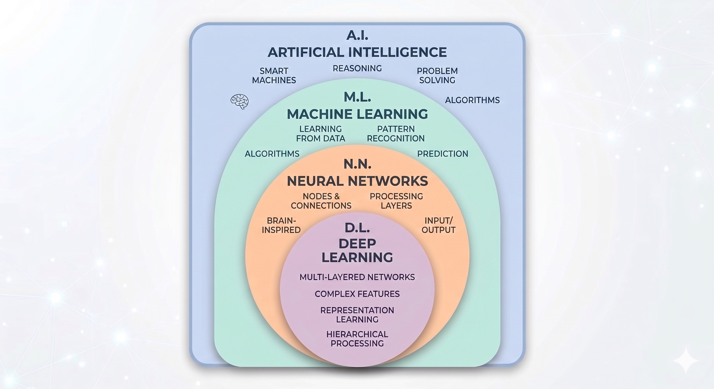
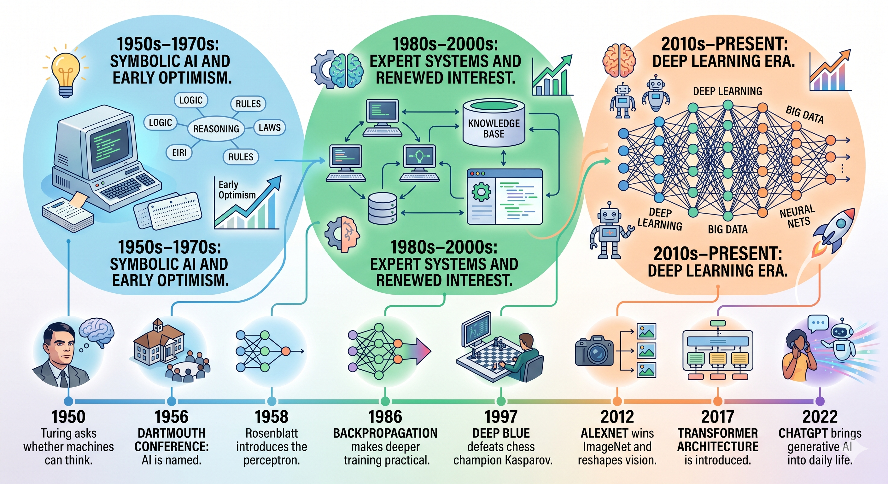
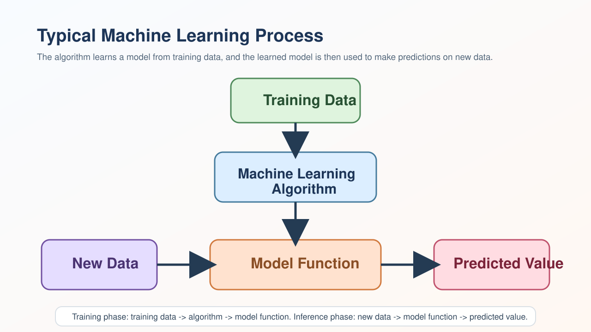
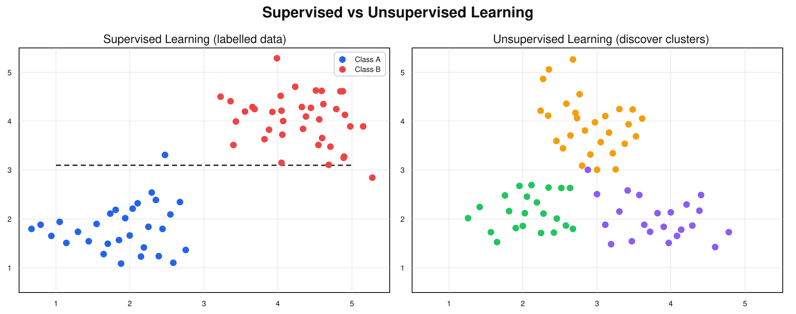
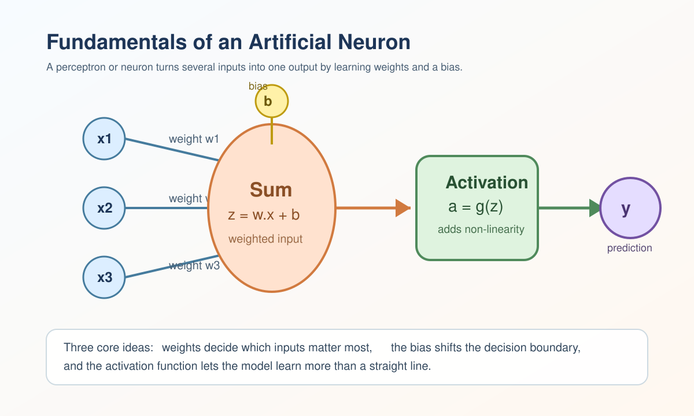
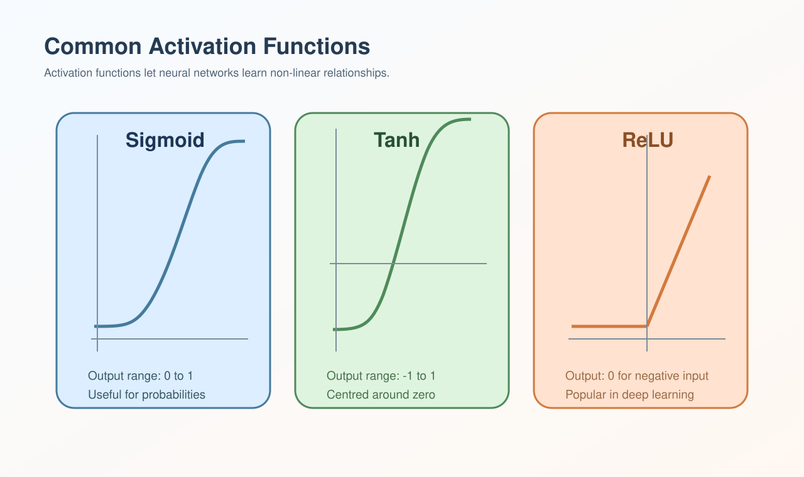
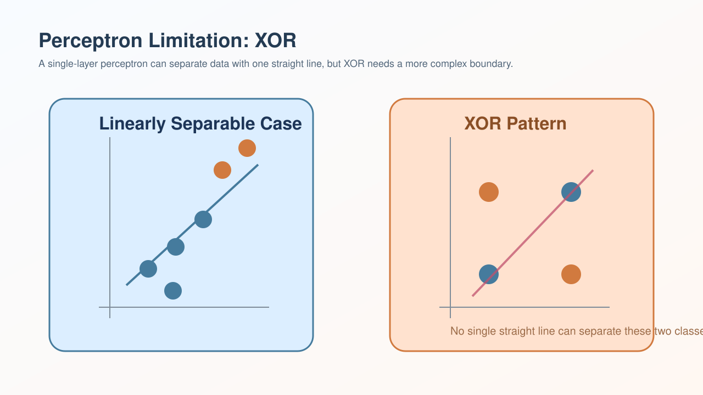
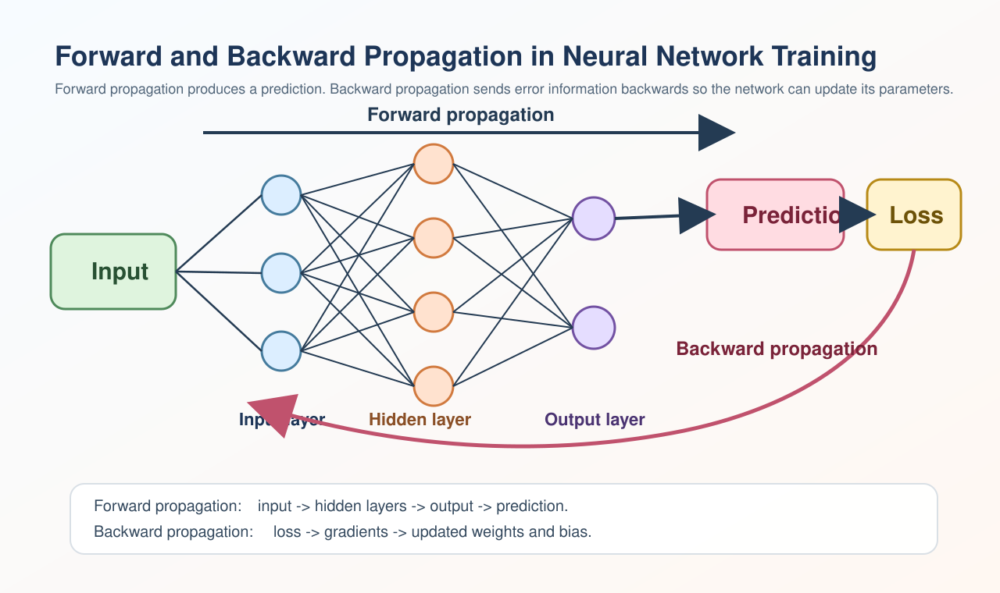
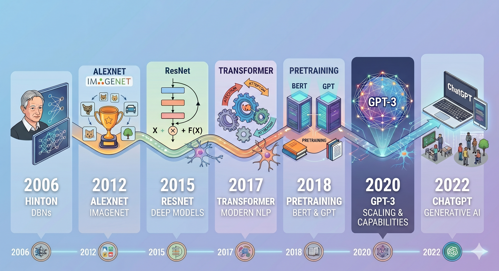
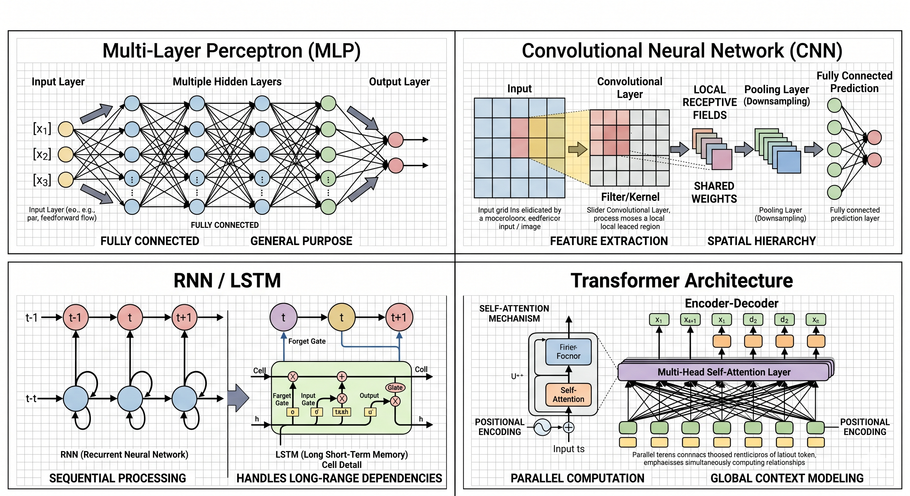

# Session 1 Introduction to AI

## Learning goals

By the end of this guide, students should be able to:

1. explain the relationship between AI, machine learning, neural networks, and deep learning;
2. outline the main stages in the history of AI;
3. explain the core ideas behind machine learning;
4. describe how a simple neural network works; and
5. summarise the most important ideas in deep learning.

## 1. Overview: AI, ML, and DL

**Artificial intelligence (AI)**, is the broad field of building systems that can perform tasks we usually associate with human intelligence. These tasks include recognising patterns, understanding language, making predictions, solving problems, and taking actions.

Within AI, **machine learning (ML)** is a more specific approach. Instead of writing every rule by hand, we give a model data and let it learn useful patterns from examples. For instance, rather than programming every rule for detecting spam email, we can train a model on many examples of spam and non-spam messages.

Within machine learning, **neural networks** are a family of models made from layers of connected artificial neurons. They are loosely inspired by the way biological neurons pass signals, although they are much simpler than real brains.

Within neural networks, **deep learning (DL)** refers to neural networks with many layers. These extra layers allow the model to learn increasingly abstract features, which is why deep learning has become so important in image recognition, speech processing, natural language processing, and generative AI.



### A simple way to remember the relationship

| Term | What it means | Example |
| --- | --- | --- |
| AI | The broad goal of making machines act intelligently | planning, robotics, expert systems |
| ML | A way for systems to improve from data | regression, decision trees, classifiers |
| Neural networks | A type of ML model built from connected layers | multilayer perceptrons, CNNs |
| Deep learning | Neural networks with many layers | Transformers, large language models |

### Why people often confuse these terms

People often use these words as if they mean the same thing, but they do not:

- not all AI uses machine learning;
- not all machine learning uses neural networks; and
- deep learning is only one branch of neural networks, even though it is currently one of the most influential branches.

## 2. A short history of AI

The local course materials describe AI as a field with several waves of excitement, disappointment, and renewal. That is a helpful way to understand its history.



### Early ideas and the birth of AI

- In **1950**, Alan Turing asked whether machines could think, which helped shape the intellectual foundations of AI.
- In **1956**, the **Dartmouth Conference** gave the field its name: artificial intelligence.
- In the late 1950s, researchers such as **Frank Rosenblatt** introduced the **perceptron**, an early neural model.

### The first wave: symbolic AI

The first wave was strongly shaped by **symbolism**. Researchers believed intelligence could be expressed through symbols, logic, and rules. This led to systems that were good at formal reasoning, puzzle solving, and carefully defined tasks.

This approach was important, but it also had limits. Real life is messy. Human knowledge is full of exceptions, ambiguity, and common sense that are difficult to write down as neat logical rules.

### The second wave: expert systems

In the 1970s and 1980s, **expert systems** became popular. These systems stored large sets of hand-written rules from specialists in areas such as medicine or engineering. They could perform well in narrow domains, but they were expensive to build and hard to maintain.

### The third wave: machine learning and deep learning

From the late 20th century into the 21st century, AI shifted towards **learning from data** rather than relying only on hand-written rules. Several milestones helped this change:

- **1986**: backpropagation made neural network training far more practical;
- **1997**: IBM Deep Blue defeated chess champion Garry Kasparov;
- **2012**: AlexNet showed the power of deep learning for computer vision;
- **2017**: the Transformer architecture changed the direction of language and sequence modelling;
- **2022 onwards**: generative AI systems became widely visible in everyday life.

### Three classic schools of thought

The lecture slides also highlight three ways researchers have tried to build intelligence:

- **symbolism**: intelligence through logic and knowledge representation;
- **behaviourism**: intelligence through perception, action, and feedback control; and
- **connectionism**: intelligence through networks of neuron-like units.

Modern AI often combines ideas from more than one school, but deep learning is most closely linked to **connectionism**.

## 3. Fundamentals of machine learning

Before studying neural networks, students need a clear picture of what machine learning is trying to achieve.



### 3.1 The basic system

Machine learning can be understood as a simple system:

- **data** provide examples;
- **features** represent useful information from the data;
- a **learning algorithm** adjusts parameters during training;
- the trained **model** makes predictions; and
- **evaluation** checks whether the model works well on new data.

The main goal is not only to perform well on familiar examples, but also to **generalise** to unseen examples.

### 3.2 Two main learning settings

The two most important beginner categories are:

**Supervised learning**

- uses labelled data;
- common tasks are **regression** and **classification**.

**Unsupervised learning**

- uses unlabelled data;
- common tasks include **clustering** and **dimensionality reduction**.



### 3.3 The key terms to remember

- **feature**: an input used by the model;
- **label**: the correct answer in supervised learning;
- **model**: the learned mapping from input to output;
- **loss**: a measure of prediction error;
- **training**: the process of improving the model parameters;
- **generalisation**: performing well on new data.

This foundation matters because deep learning is built on exactly these ideas.

## 4. Fundamentals of neural networks

To understand neural networks, it helps to start with a single artificial neuron.



### 4.1 From linear models to neurons

Many introductory courses begin with **linear regression** because it shows the basic idea of learning from data. A model takes inputs, multiplies them by parameters, and produces an output. Training means adjusting the parameters so the output is as close as possible to the correct answer.

A simple artificial neuron follows the same broad pattern:

1. it receives inputs such as `x1`, `x2`, and `x3`;
2. each input is multiplied by a **weight**;
3. the weighted inputs are added together with a **bias**;
4. the result is passed through an **activation function**; and
5. the neuron produces an output.

This is often written as:

```text
z = w.x + b
a = g(z)
```

Here:

- `w` stands for the weights;
- `x` stands for the inputs;
- `b` is the bias;
- `z` is the weighted sum; and
- `g(z)` is the activation function.

### 4.2 Why weights and bias matter

The **weights** tell the model which inputs should matter more. A large positive weight means an input strongly pushes the prediction upward. A negative weight pushes it the other way.

The **bias** lets the model shift the decision boundary. Without it, the neuron would be too rigid and could only represent a narrower set of patterns.

### 4.3 Why activation functions matter

If every layer only performed straight-line calculations, the whole network would still behave like one large linear model. The **activation function** introduces **non-linearity**, which allows the model to learn more complex patterns.

Common activation functions include:

- **sigmoid**: squashes values into the range from 0 to 1;
- **tanh**: squashes values into the range from -1 to 1;
- **ReLU**: returns `0` for negative inputs and keeps positive inputs unchanged.

In modern deep learning, **ReLU** and related functions are especially common because they help training remain efficient.



### 4.4 From one neuron to a network

A single neuron is quite limited. When we connect many neurons into layers, we get a **neural network**.

- The **input layer** receives the data.
- One or more **hidden layers** transform the data.
- The **output layer** produces the final prediction.

If every neuron in one layer connects to every neuron in the next layer, the model is often called a **fully connected network** or **multilayer perceptron (MLP)**.

### 4.5 The perceptron and its limitation

The **perceptron** was one of the earliest neural models. It can separate classes when the data are **linearly separable**, which means one straight boundary is enough.

However, a single-layer perceptron cannot solve every problem. A classic example is **XOR**, which cannot be separated by just one straight line. This limitation helped motivate the move to multi-layer networks.



### 4.6 Loss and learning

Neural networks learn by reducing a **loss function**, which measures how far the model's prediction is from the correct answer. A smaller loss usually means a better model.

The basic learning loop is:

1. make a prediction;
2. compare it with the true answer;
3. compute the loss;
4. adjust the parameters to reduce the loss; and
5. repeat many times.

### 4.7 Forward and backward propagation in training



In neural network training, the learning loop is usually described in two linked stages:

**Forward propagation**

- the input moves through the network layer by layer;
- each neuron applies weights, bias, and an activation function;
- the network produces a prediction.

**Backward propagation**

- the prediction is compared with the correct answer using a loss function;
- the error signal is passed backwards through the network;
- the model updates its weights and bias terms to reduce future error.

This forward-and-backward cycle is repeated across many training examples. It is one of the most important ideas in neural networks because it explains how a network changes from random initial parameters to useful learned behaviour.

## 5. Fundamentals of deep learning

Deep learning is the study and use of **deep neural networks**, meaning networks with multiple hidden layers.



### 5.1 What makes a network "deep"?

A shallow model may learn direct or simple relationships. A deep model can learn a **hierarchy of features**:

- early layers may learn edges or tiny local patterns;
- middle layers may learn shapes, parts, or repeated structures;
- later layers may learn objects, concepts, or semantic meaning.

This layered feature learning is one reason deep learning works so well for images, audio, and language.

### 5.2 Key milestones since 2006

From 2006 onwards, several representative events pushed deep learning from a research topic into a mainstream technology:

1. **2006**: Geoffrey Hinton and collaborators helped restart interest in deep neural networks by showing effective ways to train deeper models.
   This mattered because it marked the modern revival of deep learning as a practical research direction.
2. **2012**: **AlexNet** won the ImageNet competition and showed that deep convolutional networks could dramatically improve image recognition.
   This mattered because success on ImageNet convinced both academia and industry that deep learning could outperform older approaches on major tasks.
3. **2015**: **ResNet** made it easier to train much deeper networks by using residual connections.
   This mattered because deeper networks became much easier to optimise, which improved performance across many areas of computer vision.
4. **2017**: the **Transformer** architecture changed sequence modelling and became central to modern language AI.
   This mattered because Transformers shifted the field away from older sequence models and towards attention-based architectures.
5. **2018**: **BERT** and **GPT** demonstrated the power of large-scale pretraining for language tasks.
   This mattered because pretraining followed by fine-tuning became a dominant strategy in natural language processing.
6. **2020**: **GPT-3** highlighted how model scaling could unlock stronger general capabilities.
   This mattered because scaling laws and very large models became a major design principle.
7. **2022**: **ChatGPT** brought generative AI into everyday public use.
   This mattered because generative AI moved from specialist research circles into education, business, and daily public discussion.

### 5.3 Why deep learning works so well

The lecture slides highlight three reasons for the rise of deep learning:

- **better algorithms**: improved training methods, activation functions, and regularisation techniques;
- **more data**: large datasets made it easier to learn useful patterns;
- **more computing power**: GPUs and related hardware allowed much larger models to be trained.

This is sometimes remembered as the **ABC of deep learning**:

- **A**lgorithms
- **B**ig data
- **C**omputing

### 5.4 Typical deep learning architectures

Different tasks often call for different model families:



| Architecture | Best known for | Example use |
| --- | --- | --- |
| MLP | general tabular or simple structured data | prediction from numeric features |
| CNN | images and spatial patterns | image classification |
| RNN and LSTM | sequential data | speech or time-series modelling |
| Transformer | long-range sequence modelling | language models, translation, chatbots |

### 5.5 What students should remember most

- Deep learning is still machine learning, but with deeper neural networks.
- Its key advantage is learning layered representations, from simple features to complex meaning.
- Its development depended on better training methods, more data, and stronger computing.
- Its success depends not only on model design, but also on data quality and computing power.

## 6. Recommended books and videos

The following resources are a practical next step for students who want to go beyond this short guide. I have grouped them by how approachable they are for beginners.

### Books

**For beginners**

- [An Introduction to Statistical Learning](https://www.statlearning.com/) by Gareth James, Daniela Witten, Trevor Hastie, Robert Tibshirani, and Jonathan Taylor.
  A very student-friendly entry point to machine learning. The official site offers book information and downloadable versions, including a Python edition.

- [Artificial Intelligence: A Modern Approach, 4th edition](https://www.pearson.com/en-us/subject-catalog/p/artificial-intelligence-a-modern-approach/P200000003500) by Stuart Russell and Peter Norvig.
  Best for students who want the bigger AI picture beyond machine learning, including reasoning, search, planning, and broader AI concepts.

**For students who want more depth**

- [Deep Learning](https://www.deeplearningbook.org/index.html) by Ian Goodfellow, Yoshua Bengio, and Aaron Courville.
  A classic deep learning text. The official website states that the online version is available for free.

### Videos and courses

**Best first video series**

- [3Blue1Brown: Neural Networks](https://www.3blue1brown.com/topics/neural-networks)
  Excellent for building visual intuition about neural networks, gradient descent, and backpropagation.

**Best beginner course**

- [Machine Learning Specialization - DeepLearning.AI](https://www.deeplearning.ai/courses/machine-learning-specialization/)
  The official course page describes it as a beginner-friendly programme created by Andrew Ng that teaches foundational machine learning concepts through an intuitive visual approach.

**Best practical deep learning course**

- [Practical Deep Learning for Coders - fast.ai](https://course.fast.ai/)
  The official site describes it as a free course for people with some coding experience who want to apply deep learning and machine learning to practical problems.

**Best university-style course**

- [Stanford CS229: Machine Learning](https://cs229.stanford.edu/)
  A strong option for students who want a more rigorous academic treatment after mastering the basics.

## 7. Glossary

| Term | Meaning |
| --- | --- |
| AI | The broad field of building machines that perform intelligent tasks. |
| Backpropagation | A method for calculating how errors should change network parameters. |
| Bias | A parameter that shifts a neuron's output. |
| Data | The examples used to train or test a model. |
| Deep learning | A branch of machine learning based on multi-layer neural networks. |
| Feature | An input variable used by a model. |
| Generalisation | The ability of a model to work well on unseen data. |
| Gradient descent | An optimisation method that updates parameters to reduce loss. |
| Label | The correct answer attached to a training example in supervised learning. |
| Loss function | A function that measures prediction error. |
| Machine learning | A branch of AI in which models learn patterns from data. |
| Model | A mathematical structure that maps inputs to outputs. |
| Neural network | A model made from connected artificial neurons. |
| Supervised learning | Learning from labelled examples. |
| Weight | A parameter showing how strongly an input affects the output. |
